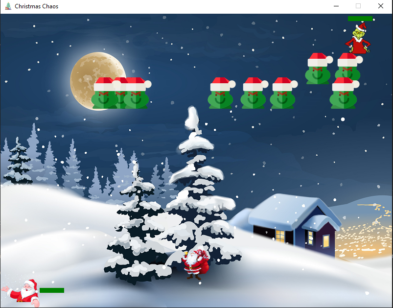

# Christmas Chaos (Game) 

A quick project I decided to do with Christmas coming right up. Recently started to learn python from scratch and figured this would be a fun way to exercise what I have learned so far.

## Description

Playable Santa is tasked with saving Christmas from being ruined by the Grinch. You must pass through three stages in order to thwart the Grinch's plans.

### Controls

Movement - left and right arrow keys.

Shoot - space key. 

### Execute program

Run main.py in the root directory.

### Levels
#### 1 - Grinch invaders
A spin off of the classic Space Invaders game. The Grinch has sent his ghouls to pose as the real Santa and enter chimneys. Santa must shoot them down before they reach the houses.

#### 2 - Gift grab
The Grinch is throwing some of the gifts he stole from the houses to slow your pace. Santa has to collect each and everyone one to avoid a child's present from being ruined. 

#### 3 - Crashing coals
Grinch unloads a barrage of coal in an attempt to eliminate Santa. Avoid getting crushed!

